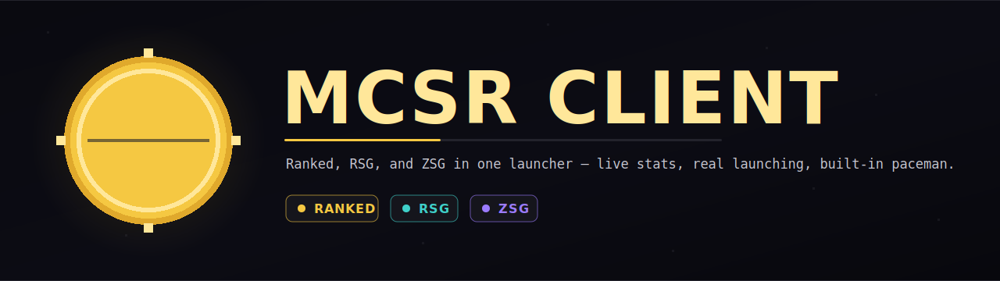
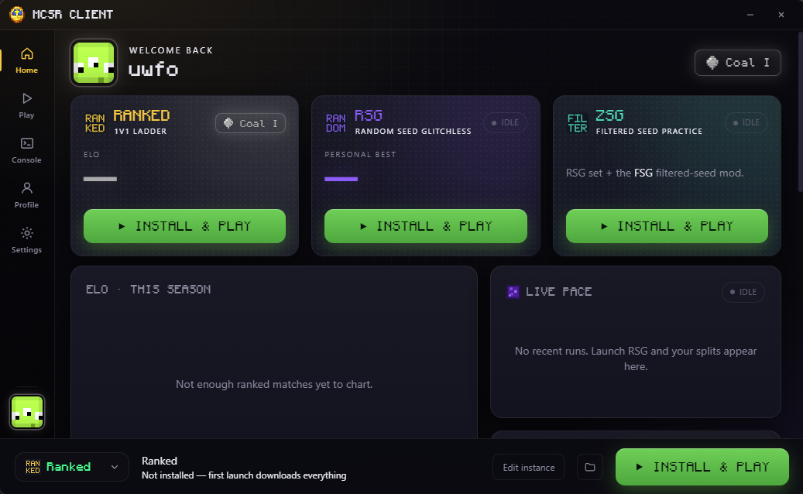

<div align="center">



<br />
<br />

[](https://github.com/xSIRDON/MCSR-Client/releases/latest)
[](https://github.com/xSIRDON/MCSR-Client/releases/latest)
[](LICENSE)

<br />

**The all-in-one desktop client for Minecraft 1.16.1 speedrunning.**

One app to sign in, install your instances, launch the game, and watch your rank climb — no third-party launcher, no manual modpack juggling.

<br />

### [⬇  Download the latest installer](https://github.com/xSIRDON/MCSR-Client/releases/latest)

<sub>Windows installer · auto-updates · v1.1.1</sub>

</div>

<br />

---

## What it is

MCSR Client is a self-contained launcher and dashboard built for the Minecraft Speedrunning Ranked community. It downloads and runs Minecraft 1.16.1 + Fabric on its own, manages Java for you, and ships ready-to-play instances for Ranked, RSG, and ZSG. Sign in with Microsoft, click an instance, and play. Your ELO, tier, pace, and recent matches live right on the home screen.

No Julti. No Jingle. No assembling a mod folder by hand. Just download, sign in, and run.

<br />

## Features

### One-click instances
Three curated, ready-to-run setups — each downloads and configures itself:

- **Ranked** — the full MCSR Ranked modpack, with the latest MCSR Ranked mod pulled straight from Modrinth.
- **RSG** — random-seed glitchless. The same legal mod set with the ranked mod removed, plus the **SeedQueue** wall for instant resets.
- **ZSG** — the RSG mod set with the **FSG** mod added on top, for filtered-seed practice.

SeedQueue wall resource packs come pre-installed for RSG and ZSG.

### Launches Minecraft for you
- Downloads and runs **Minecraft 1.16.1 + Fabric** directly — no external launcher required.
- **Java is fetched and managed** automatically.
- Sign in with your **Microsoft account**, add as many as you like, and switch between them in a click.

### Live MCSR Ranked dashboard
Your stats, front and center:

- ELO, tier (**Coal → Netherite**), peak rating, win rate, win streak, best time, and total matches.
- An **ELO-over-time chart** and a feed of your recent matches.
- The **global leaderboard** plus full **player search** — with skins and **donor-tier badges** (Stone / Iron / Diamond).

### Self-review & analytics
A dedicated review tab that turns your ranked history into insight:

- **Split Performance radar** — every split (Overworld, Nether, Bastion, Fortress, Blind, Stronghold, End) ranked by percentile against the whole field, with a toggle to compare against your own **Elo tier** instead.
- **Strengths & weaknesses** radar and plain-English insights — your **best and weakest split**, plus a "to rank up" callout showing where you lose the most time versus the tier above you.
- **Target splits** — the next tier's median split times next to yours, with the exact gaps to close.
- **Per-split timing** — Overworld, Bastion, Fortress, Blind, Stronghold, End, Finish, and Fort → Finish.
- **Seed-type breakdowns** — your pace by overworld structure and bastion type.
- Win rate, recent form, finishing, deaths, average win time, and personal-best insights drawn from your real season record.

### Compare any two players
A head-to-head tab: search two names and get overlaid **split-performance radars**, per-split
average-time gaps, and a stat-by-stat scorecard — Elo, win rate, best time, average win, streaks,
and paceman RSG PBs. Every searched profile also gets the full radar treatment, plus a one-click
**Compare with me**.

### RSG stats that are actually yours
The RSG personal best comes straight from **paceman's PB table** (not a recent-runs window), and
the profile's RSG tab lists your **recent runs with real per-split times** alongside the all-time
split funnel.

### Built-in pace tracking
- A **paceman tracker** runs alongside RSG automatically and surfaces your live pace on the home screen.

### Bundled tools, set up on install
- **Ninjabrain Bot** — the stronghold calculator, opened automatically alongside the game.
- **Toolscreen** — ready to go out of the box.

### Per-instance control
Open **Edit instance** to fine-tune anything:

- RAM and Java settings.
- Mod toggles and a practice-map picker.
- Open the game folder directly.
- **Import settings** — copy `options.txt`, `hotbar.nbt`, and the whole `config/` folder from another instance, or pull in an external `options.txt`. Offered on the Edit page and during a first-time install.

### Built for Windows
- A branded Windows installer.
- **Automatic updates** straight from GitHub.
- The app version is always visible in the sidebar.

<br />

## A look inside

<div align="center">



<br />
<sub>The home screen — instances, live pace, and your Ranked stats at a glance.</sub>

</div>

<br />

## Build from source

Want to hack on it? You'll need [Node.js](https://nodejs.org/) installed.

```bash
# install dependencies
npm install

# run in development
npm run dev

# build a distributable installer
npm run dist
```

<br />

## Credits

Built and maintained by **xSIRDON**.

Made possible by the tools and communities that power Minecraft speedrunning:

- **MCSR Ranked** and the wider Minecraft Speedrunning Ranked community
- **Fabric**
- **SeedQueue** and **FSG**
- **Ninjabrain Bot**
- **paceman**
- **Modrinth**

Huge thanks to everyone in the MCSR community who builds, tests, and runs.

<br />

## License

Released under the [MIT License](LICENSE). © 2026 xSIRDON.
